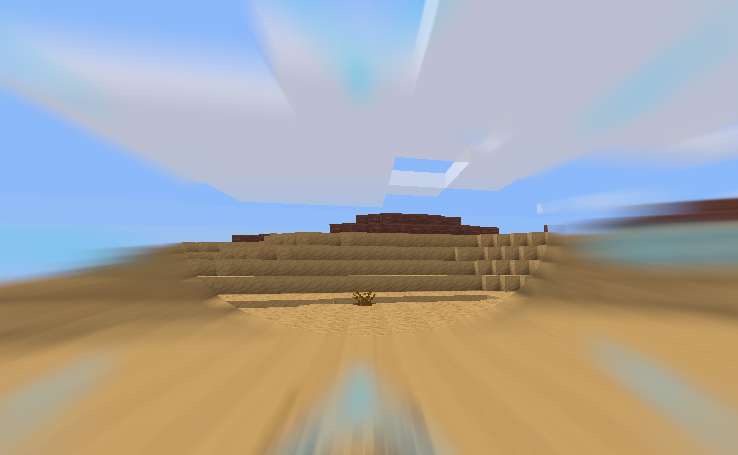

# Dashing (`dash`)

Minetest mod adding a different way of boosting. An alternative to the [sprint](https://github.com/GunshipPenguin/sprint) mod.

## About

Depends on the latest [`modlib`](https://github.com/appgurueu/modlib) and [`hud_timers`](https://github.com/appgurueu/hud_timers).

Code licensed under the MIT license. Written by Lars Mueller alias LMD or appguru(eu).

## Links

* [GitHub](https://github.com/appgurueu/dash) - sources, issue tracking, contributing
* [Discord](https://discordapp.com/invite/ysP74by) - discussion, chatting
* [Minetest Forum](https://forum.minetest.net/viewtopic.php?f=9&t=24211) - (more organized) discussion
* [ContentDB](https://content.minetest.net/packages/LMD/dash/) - releases (cloning from GitHub is recommended)

## Symbolic Representation

## Setup

Install the mod like any other, using `git clone https://github.com/appgurueu/dash.git` or installing via ContentDB & the in-game content manager. Enable it, `modlib` & `hud_timers` and you're ready to dash!

## Features

Dash by holding/pressing the "special" key (usually <kbd>E</kbd>). A timer shows whether you're currently charging/dashing. During dashing, speed & jump height increase rapidly, while gravity/downforce decreases.

## Configuration

<!--modlib:conf:2-->
### `charging`

Time it takes to charge a dash in seconds.

* Type: number
* Default: `3`
* &gt;= `0`
* &lt;= `10`

### `dashing`

Time it takes to dash in seconds.

* Type: number
* Default: `1`
* &gt;= `0`
* &lt;= `10`

### `effects`

#### `gravity`

Additive gravity modifier

* Type: number
* Default: `-0.1`
* &gt;= `-10`
* &lt;= `10`

#### `jump`

Additive jump modifier

* Type: number
* Default: `0.5`
* &gt;= `-10`
* &lt;= `10`

#### `speed`

Multiplicative speed modifier

* Type: number
* Default: `2`
* &gt;= `-10`
* &lt;= `10`

### `hold`

Whether to hold or press the special key.

* Type: boolean
* Default: `true`

### `particles`

Maximum of node particles to be spawned when somebody is dashing. Set to zero for no particles.

* Type: number
* Default: `5`
* &gt;= `0`
* &lt;= `100`

### `polynomial`

A polynomial definining the dashing intensity. List of coefficients starting with the one for `x^0`.
<!--modlib:conf-->